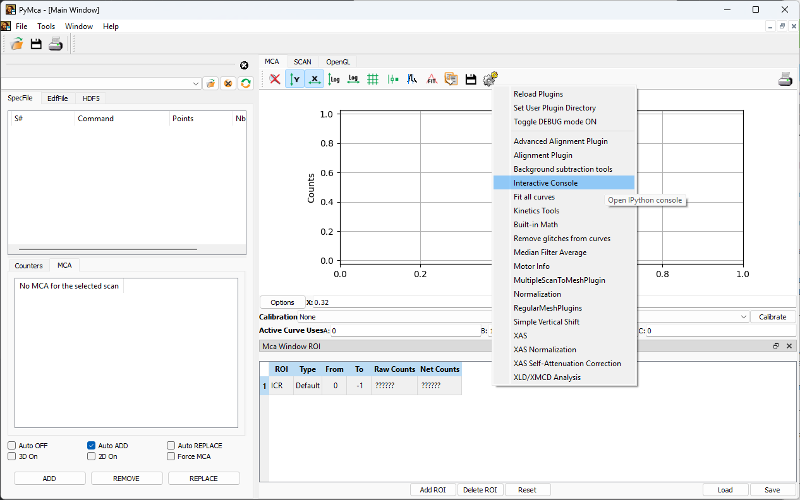

Contributing
============

Developers installation
-----------------------

Editable install with all requirements

.. code:: bash

    pip install -r requirements.txt -e .

Start the main application

.. code:: bash

    pymca

or using the module directly

.. code:: bash

    python -m PyMca5.PyMcaGui.pymca.PyMcaMain

Release
----------
Main steps
#######

1) Update version in ``src/PyMca5/__init__.py``
2) Wait until release action is finished
3) Download and `test` Windwos and MacOS frozen binaries
4) Update ``changelog.txt``

Start
#######

Start the release procedure by push a commit to the `master` branch with modified version in `src/PyMca5/__init__.py`. PRs do not work for releases. If the release pipeline fails during the `wheels` step before uploading to test-PyPI, changes can be commited and the release pipeline can be started manually.
The release includes upload wheels to test-PyPI and PyPI as well as creating executable files (installer for Windows and universal dmg for MacOS).

The entire release pipeline can take about an hour.

If you need to make complicated modifications into CI workflow - please create a fork run all your CI in the fork - you will need to comment uploading to testPyPI and PyPI as well as DMG packaging (since it require secrets).

Test
#######

The CI run tests on wheels and try to run tests in GUI. To be sure that there is no bugs the tests should be run directly in frozen (fat) binaries manually using the following procedure:

`call/load 1D plugins` → `interactive console`

.. code:: bash

   from PyMca5.tests import TestAll
   TestAll.main()

Few tests will be skipped, and none should fail.

Please notice that tests `should` be performed on Windows, MacOS-arm64 and MacOS-x86.

Changelog
#########

A list of pull requests will be generated in the release comments but not in ``changelog.txt``, which should be updated manually, since not all pull requests are described clearly when created.

Availability
############
New versions of PyMca5 will be distributed via github releases.

Older version (<5.9.5) are available at https://sourceforge.net/projects/pymca/files/pymca/PyMca5.9.4/

